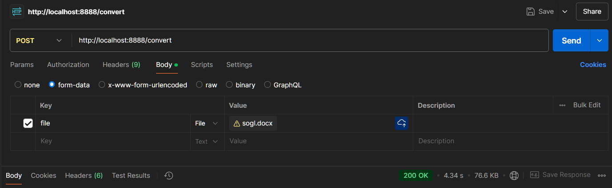

# docx2pdf
Simple docx to pdf converter, based on python and libreoffice

How to launch:
1) build image: `docker build -t docx2pdf .`
2) run container: `docker run -d -p 8080:8080 docx2pdf`

 Now you can convert your .docx files using POST request to `http://localhost:8080/convert` with body in form-data: 'file' field containing your .docx file.

